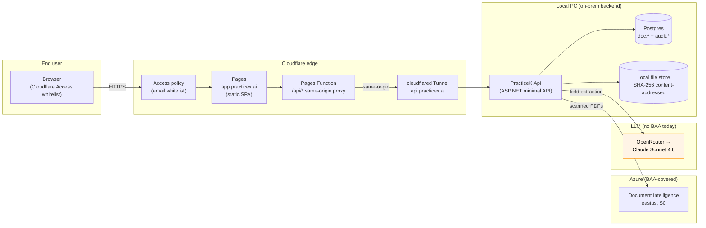
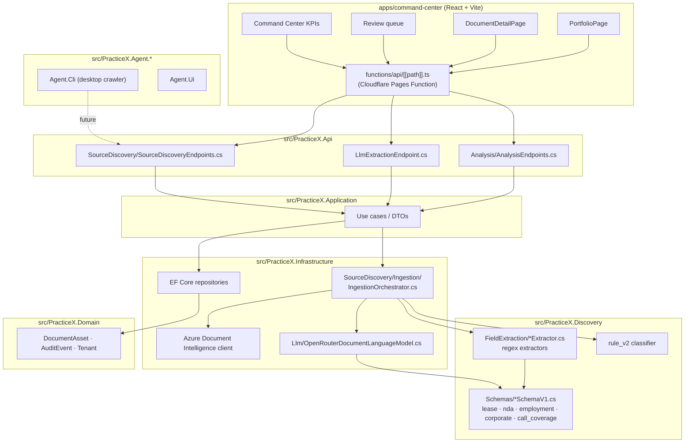
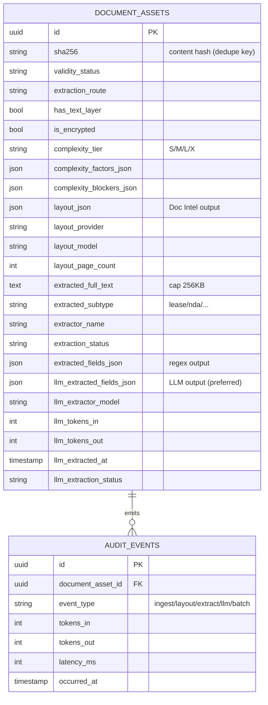

# PracticeX Command Center — System Architecture

High-level architecture as of slice 15 (commit `5e739b4`, 2026-04-29).
Companion document: [`workflow.md`](./workflow.md) — document processing pipeline.

---

## Deployment topology

Notes:
- `app.practicex.ai` is gated by Cloudflare Access; `api.practicex.ai` is publicly reachable today (service-token harden pending — see roadmap polish item 5).
- Source PDFs never leave the local disk. Only extracted text + structured fields traverse the LLM boundary.
- OpenRouter path is the compliance gap; must move to Azure-OpenAI BAA or Anthropic-direct BAA before paid customers.

---

## Solution layout

---

## Data spine

`doc.document_assets` is the single read model for the Portfolio + Document Detail surfaces. Cross-document insights (amendment chains, counterparty graph, address registry, total sqft) are computed on read by aggregating across rows — no materialized view yet.

---

## Trust boundaries & compliance

| Boundary | Data crossing | BAA status |
|---|---|---|
| Browser → Cloudflare Access → Pages | UI traffic only | N/A (no PHI in transit) |
| Pages → Tunnel → local API | API calls (tenant-scoped) | Cloudflare zero-trust; service-token harden pending |
| API → Postgres / local FS | Full PHI (extracted text, source PDFs) | Local — never leaves disk |
| API → Azure Document Intelligence | Scanned PDF bytes + extracted layout | ✅ Microsoft Azure BAA (eastus, S0) |
| API → OpenRouter → Anthropic | Extracted text + JSON schema | ⚠️ No BAA — Eagle GI demo only |

See roadmap "Compliance posture" + Phase 4 "Compliance hardening" for the migration plan.

---

## Where to find things in code

- API endpoints: `src/PracticeX.Api/Analysis/AnalysisEndpoints.cs`, `LlmExtractionEndpoint.cs`, `SourceDiscovery/SourceDiscoveryEndpoints.cs`
- Pipeline orchestration: `src/PracticeX.Infrastructure/SourceDiscovery/Ingestion/IngestionOrchestrator.cs`
- Extractors: `src/PracticeX.Discovery/FieldExtraction/*Extractor.cs`
- Schemas: `src/PracticeX.Discovery/Schemas/*SchemaV1.cs`
- LLM provider: `src/PracticeX.Infrastructure/SourceDiscovery/Llm/OpenRouterDocumentLanguageModel.cs`
- Frontend: `apps/command-center/src/views/PortfolioPage.tsx`, `DocumentDetailPage.tsx`
- Cloudflare proxy: `apps/command-center/functions/api/[[path]].ts`
