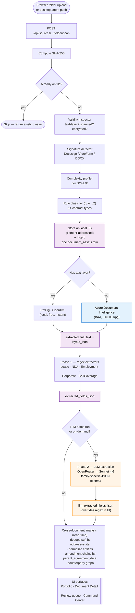
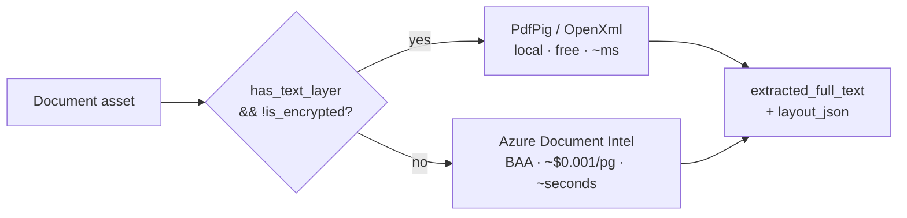
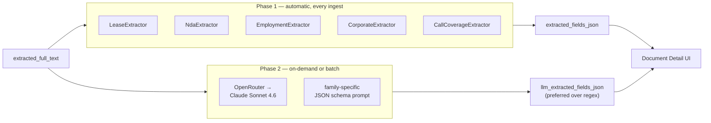

# PracticeX Command Center — Document Workflow

End-to-end pipeline from raw upload to UI surface, as of slice 15.
Companion document: [`architecture.md`](./architecture.md) — system topology and components.

---

## End-to-end pipeline

---

## Stage details

### 1. Ingest
- **Browser flow**: folder picker uploads file metadata + bytes via `POST /api/sources/.../folder/scan`.
- **Desktop agent** (specced in `docs/desktop-discovery-agent.md`): walks on-prem network shares, pushes to the same endpoint.
- **SHA-256 dedupe** happens before bytes are persisted — repeat uploads are no-ops.

### 2. Classify
Four parallel passes on first ingest, all results stored on `doc.document_assets`:
- **Validity inspector** → `validity_status`, `has_text_layer`, `is_encrypted`
- **Signature detector** → Docusign envelope / AcroForm / DOCX signed-block detection
- **Complexity profiler** → `complexity_tier` (S/M/L/X), drives pricing model later
- **Rule classifier (rule_v2)** → 14 contract types: `lease` · `lease_amendment` · `lease_loi` · `nda` · `employment` · `amendment` · `call_coverage_agreement` · `bylaws` · `service_agreement` · `processor_agreement` · `payer_contract` · `vendor_contract` · `fee_schedule` · `unknown`

### 3. Storage
Local file system, content-addressed by SHA-256, partitioned per tenant. Source PDFs never leave the laptop.

### 4. Text extraction (routing decision)

`extracted_full_text` is capped at 256KB and persists alongside the Doc Intel `layout_json` so the UI can show snippets without re-fetching layout.

### 5. Field extraction — two phases

- **Phase 1** runs on every ingest — fast, free, deterministic.
- **Phase 2** runs on demand or via batch — ~5-10 sec per doc, ~$0.01-0.02 per doc, higher accuracy. UI prefers LLM data when present.

### 6. Cross-document analysis (read-time)
Computed on read by aggregating across `doc.document_assets`, LLM data preferred, regex as fallback:
- **Address registry + total sqft** — dedupe by `(street_address, suite)` to avoid amendment double-counting
- **Entity normalization** — fuzzy-match landlords / tenants / counterparties (case + punctuation insensitive)
- **Amendment chains** — link by `parent_agreement_date` to surface the master + amendment ladder
- **Counterparty graph** — exclude entities already shown as landlord/tenant, surface the rest

### 7. Surface
Portfolio (KPIs + family rollups + insights panel) · Document Detail (inline PDF + extracted fields) · Review queue · Command Center · `/api/analysis/insights`.

---

## Audit trail

Every stage emits to `audit.audit_events` with token counts + latency:
- `ingest` — file received, hash computed, dedupe decision
- `layout` — local vs Doc Intel routing, page count, latency
- `extract.regex` — extractor run, fields populated, status
- `extract.llm` — model, tokens in/out, latency, status
- `batch.llm` — batch run summary

---

## Failure modes & current gaps

| Stage | Gap | Mitigation |
|---|---|---|
| Cross-doc — total sqft | Over-counts when amendments reference same suites (78,343 vs. true ~23,743) | Dedupe by `(address, suite)` — polish item 1 |
| Cross-doc — entities | "Eagle Physicians, P.A." vs "EAGLE PHYSICIANS AND ASSOCIATES, PA" treated as separate | Case + punctuation fuzzy match — polish item 2 |
| Cross-doc — counterparties | Landlords/tenants double-listed as counterparties | Filter set difference — polish item 3 |
| Regex — `EmploymentExtractor` | `phi_agreement` fires on any HIPAA mention | Require explicit "Business Associate" / "PHI" structure — polish item 4 (LLM already correct) |
| LLM provider | OpenRouter has no BAA | Demo-only today; Phase 4 migrates to Azure-OpenAI BAA or Anthropic-direct BAA |
| API exposure | `api.practicex.ai` reachable without auth | Service-token gate — polish item 5 |

Source: `docs/roadmap.md` polish list + Phase 4 compliance hardening.
